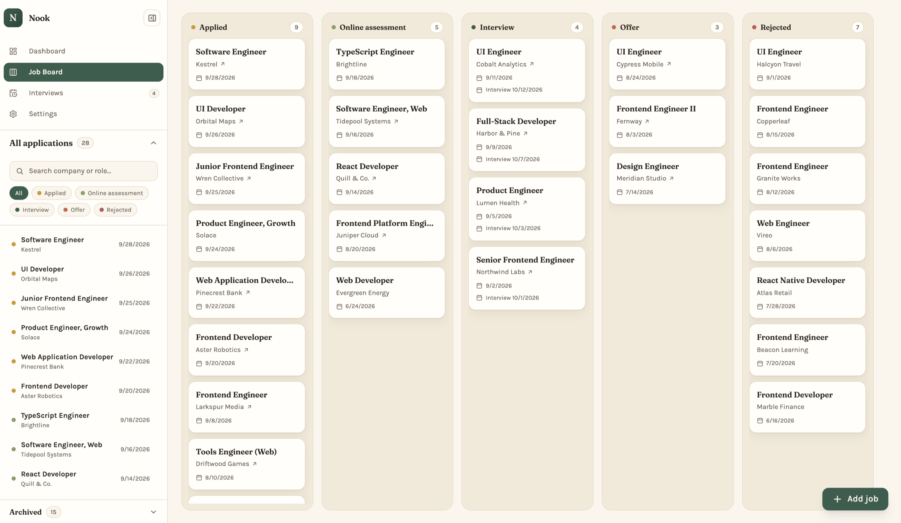
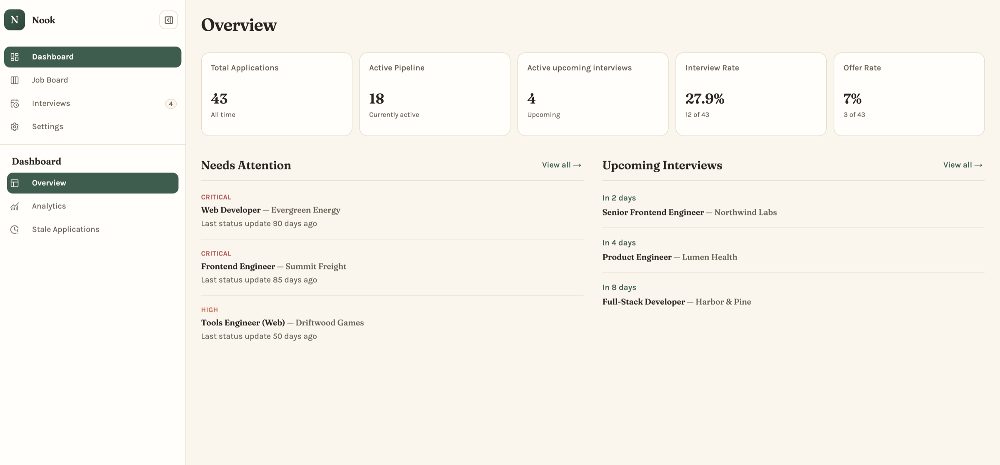
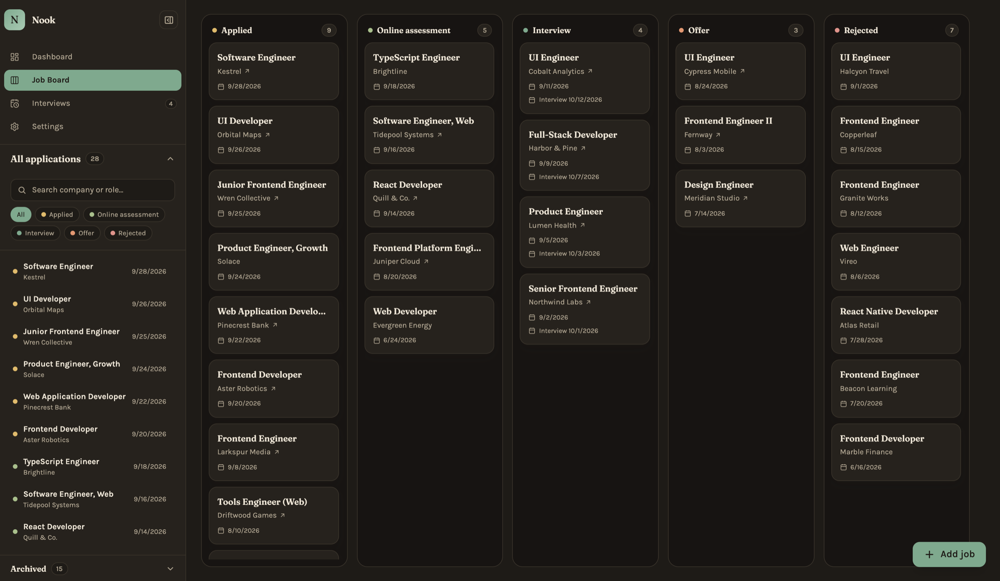
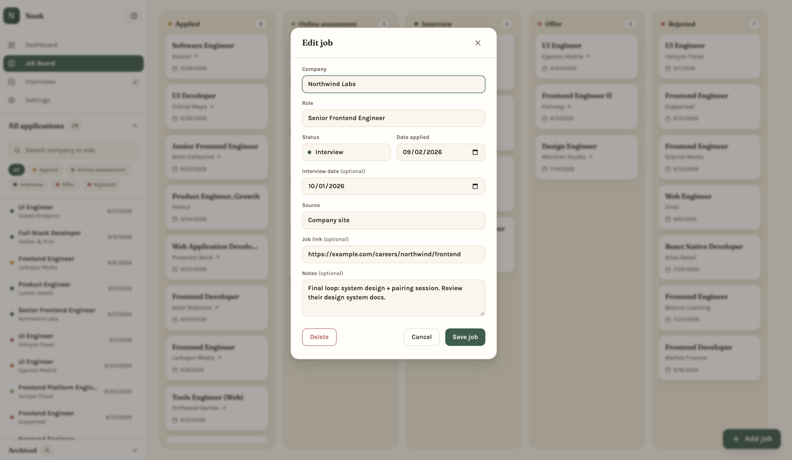
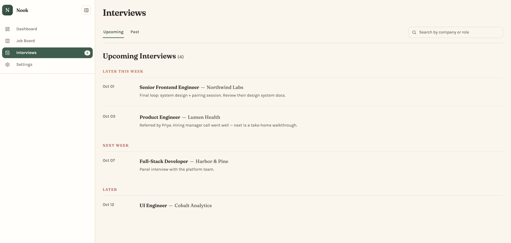
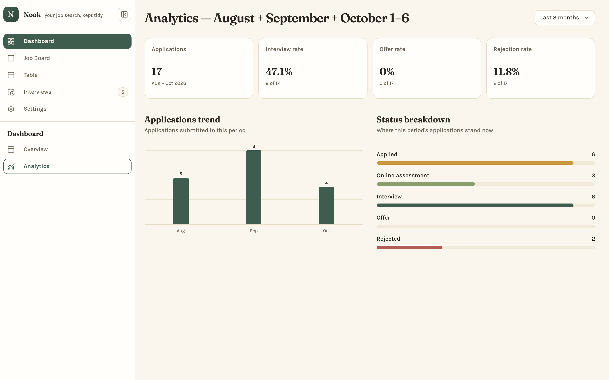
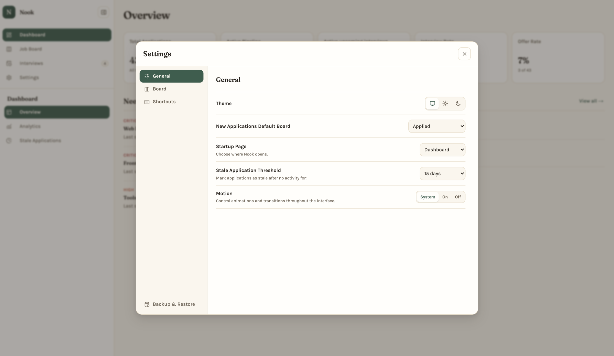

<div align="center">

# Nook

**A job application tracker that runs on your own computer.**

Track where you applied, move applications through each stage, keep interview dates in one place, and see how your search is going. No account needed, and your data stays on your machine.



</div>

## Contents

- [What you can do](#what-you-can-do)
- [Getting started](#getting-started)
- [Using Nook](#using-nook)
- [Keyboard shortcuts](#keyboard-shortcuts)
- [Your data](#your-data)
- [Updating Nook](#updating-nook)
- [Troubleshooting](#troubleshooting)

## What you can do

### See your search at a glance

The Overview shows your total applications, your active pipeline, upcoming interviews, and your interview and offer rates. It also lists the applications that need attention.



### Move applications through a board

The Job Board has a column for each stage: **Applied**, **Online assessment**, **Interview**, **Offer**, and **Rejected**. Drag a card to update its status, or use the keyboard. Cards show the company, how long ago you applied, the next interview round, a follow-up reminder, the source, a link to the job posting, and a **Stale** marker when an application has gone quiet. Search and filter the board by status or source from the toolbar above it. The sidebar lists every application, with its own search and status filters.

<p align="center">
  
</p>

### Keep the details together

Each application stores the company, role, status, date applied, source, a link to the posting, and a summary note. Click any application to open its details panel. There you can:

- add **interview rounds**, each with a date, an optional time, a type (phone, technical, onsite, or other), who you met, and notes
- keep **contacts** such as recruiters and referrers, with their role, email, and LinkedIn
- set a **follow-up reminder**; when it's due, the application shows up in Needs Attention
- write **dated notes** that appear in the timeline next to every status change, and edit or delete them later

Choose **Edit** in the panel to change the main details. Sources you've used before are suggested as you type. If a new entry looks like one you already have, Nook shows the possible match before you save.



### See everything in a table

The Table page lists every application in sortable columns. Filter by status, source, date applied, or archived, then select several applications to change their status or archive them at once. One Undo reverts the whole change.

### Stay on top of interviews

The Interviews page lists every interview round, grouped by when it happens (this week, next week, later), with its type, time, who you're meeting, and your notes. Click an interview to open its application. When you move an application to Interview, Nook asks for the first round's date.

A **Past** tab keeps earlier interviews, and you can search by company or role.



### Review your progress

Analytics shows how many applications you sent in a period, your interview, offer, and rejection rates, and a breakdown by status. You can view the current month, the last 3 months, the current year, or a specific month or year. Click a number, a chart bar, or a status to see those applications in the Table.



### Follow up on quiet applications

**Needs Attention** on the Overview lists follow-up reminders that are due, then active applications whose status hasn't changed for a while, longest waiting first. An application that never changed status counts from its applied date. Click **View all** for the full list. In Settings you can set the threshold to 7, 15, or 30 days.

### Make it yours

- **Theme:** light, dark, or match your system.
- **Motion:** turn animations on or off, or follow your system's reduced-motion setting.
- **Board colors:** choose a color for each status.
- **Startup page:** open to the Dashboard, the Job Board, or Interviews.
- **Default board:** choose the status new applications start in.



### Also included

- **Archive:** move finished applications off the board, then restore them whenever you want.
- **Undo:** press `U` to undo your most recent status change, archive, or deletion. You can undo a deletion for up to 10 minutes.
- **Backup & Restore:** export all your data to a JSON file and import it again later or on another computer.

## Getting started

### What you need

- [Node.js](https://nodejs.org/) **22.18 or later on the 22.x line, or 23.6 or newer** (npm comes with it)
- [Git](https://git-scm.com/downloads)

To check your Node.js version, run `node --version` in a terminal.

### Install

Open a terminal and run:

```bash
git clone https://github.com/X1REN41L/nook-job-tracker.git
cd nook-job-tracker
npm install
npm run setup
```

`npm run setup` creates your local database. You only need to run it once. If you run it again, it keeps your existing data.

### Start Nook

```bash
npm run dev
```

When the terminal shows that the server is ready, open **[http://127.0.0.1:3000](http://127.0.0.1:3000)** in your browser.

Nook runs only while this terminal is open. To stop it, press `Ctrl+C` or close the terminal. Your data stays saved. To open Nook again later, go to the `nook-job-tracker` folder and run `npm run dev`.

<details>
<summary><strong>Optional: run a production build</strong></summary>

A production build takes a minute to create, but pages load faster afterwards:

```bash
npm run build
npm run start
```

Then open [http://127.0.0.1:3000](http://127.0.0.1:3000). Run `npm run build` again after each update.

</details>

## Using Nook

1. **Add an application.** On the Job Board, click **Add job**, or press `N` anywhere. Only the company, role, and date applied are required.
2. **Update its status.** Drag the card to another column. From the keyboard, focus the card, press `Space` to pick it up, use the Left and Right arrow keys to choose a column, and press `Space` again to drop it (`Esc` cancels).
3. **Review and edit details.** Click a card, or focus it and press `Enter`, to open its details. Add interview rounds, contacts, notes, and a follow-up reminder there, or choose **Edit** to change the main details.
4. **Check in regularly.** The Dashboard shows upcoming interviews and applications that need a follow-up.
5. **Back up your data.** In **Settings → Backup & Restore**, export a backup from time to time.

## Keyboard shortcuts

Press `?` anywhere in Nook to see every shortcut.

| Action | Shortcut |
| --- | --- |
| Command palette: go to a page, run an action, or find an application | `Ctrl+K` / `⌘K` |
| Search this page | `/` |
| New job | `N` |
| Edit the open application | `E` |
| Undo | `Ctrl+Z` / `⌘Z` |
| Close a dialog | `Esc` |
| Toggle sidebar | `Ctrl+Shift+S` / `⌘⇧S` |
| Settings | `Ctrl+Shift+,` / `⌘⇧,` |
| Show all shortcuts | `?` |
| Go to Dashboard / Analytics / Job Board / Table / Interviews | `G` then `D` / `A` / `J` / `T` / `I` |
| Move between cards (Job Board) | Arrow keys |
| Open card (Job Board) | `Enter` |
| Pick up or drop card; arrows move it while held (Job Board) | `Space` |
| Archive focused card (Job Board) | `E` |
| Delete focused card (Job Board) | `Delete` or `Backspace` |
| Switch Upcoming / Past (Interviews) | `←` / `→` |

Keyboard moves on the Job Board are announced to screen readers. When you close a dialog, focus goes back to where you were.

## Your data

- **Everything stays on your computer.** Nook doesn't need an account or an internet connection, and it doesn't send your application data anywhere.
- Your data is saved in one file: `prisma/dev.db` inside the Nook folder.
- Nook only accepts connections from your own computer (`127.0.0.1` or `localhost`). You can't open it from another device on your network.

### Backup & Restore

Open **Settings → Backup & Restore**.

- **Export** saves every application (including archived ones and their status history) and your settings to a JSON file.
- **Import** adds applications from a Nook backup file:
  - The file can be up to 10 MB and contain up to 5,000 applications. If the file isn't a valid Nook backup, nothing changes.
  - New applications are added. Applications you already have that exactly match the backup are skipped.
  - If an application in the backup was changed after the backup was made, the import stops and nothing is imported. Nook names up to three of the changed applications so you can check them.
  - If a backup application looks like one you already have, Nook asks whether to import it anyway.
  - After a successful import, your settings are replaced with the ones in the backup.

To move Nook to another computer, export a backup, install Nook on the new computer, and import the backup there.

## Updating Nook

Stop Nook first, then run these commands in the Nook folder:

```bash
git pull
npm install
npm run setup
```

Your data file is kept. When an update changes how data is stored, `npm run setup` upgrades the file for you; for example, it turns each application's saved interview date into an interview round.

Backups exported by an older version may not import into a newer one, so export a fresh backup after you update.

## Troubleshooting

**npm shows a Node.js version warning or error.**
Install a supported version of Node.js (22.18+ or 23.6+), then run `npm install` and `npm run setup` again.

**The page won't load.**
Make sure the terminal running `npm run dev` is still open, and use `http://127.0.0.1:3000`, not your computer's network IP address.

**Port 3000 is already in use.**
Start Nook on a different port with `npm run dev -- -p 3001`, then open `http://127.0.0.1:3001`.

## License

Nook is released under the [MIT License](LICENSE).
