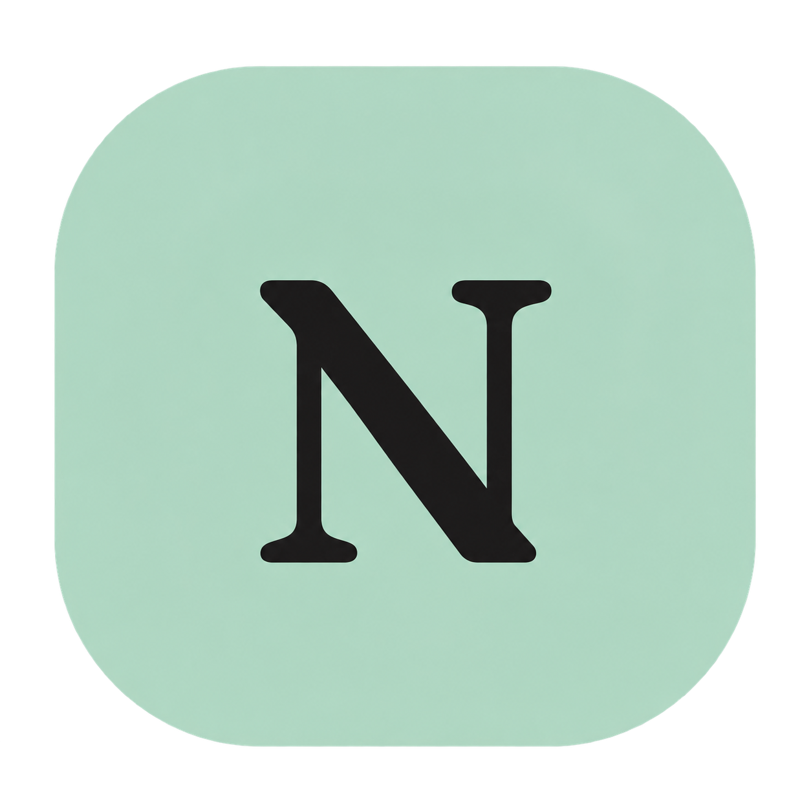
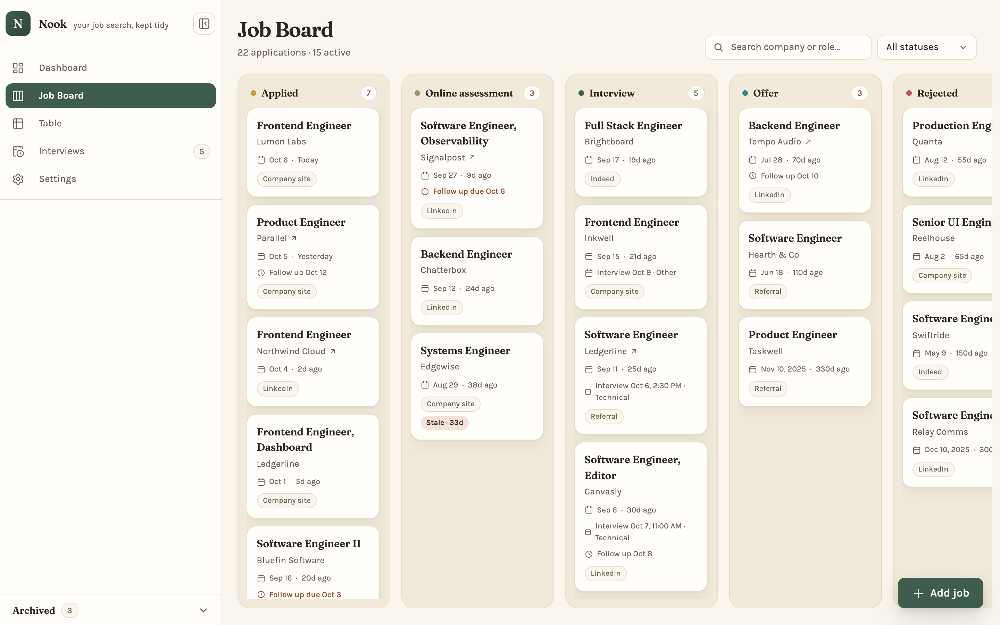
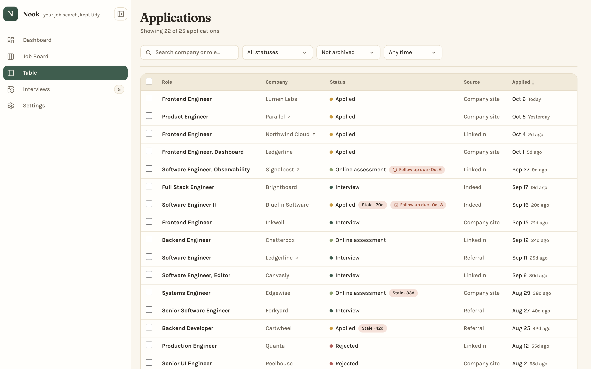
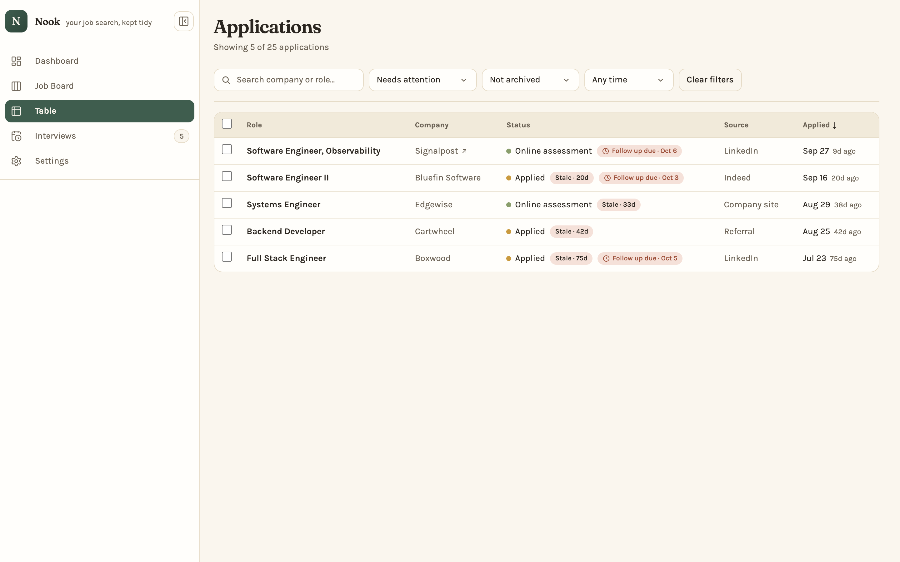

<p align="center">
  
</p>

<h1 align="center">Nook</h1>

<p align="center">A private job tracker that runs entirely on your own computer.</p>


## Local and private

Nook is a desktop web app that runs on your machine and nowhere else.

- **Your data stays on your computer.** Every application, note, contact, and interview lives in a single SQLite file in the project folder.
- **No accounts, no cloud, no hosting.** There is nothing to sign up for, and the app makes no outside network requests while you use it.
- **Only reachable from your own computer.** Nook listens on `127.0.0.1`, so other devices on your network can't connect, and requests using any other host name are refused.

Installing and building does download packages from npm. Next.js also collects anonymous CLI usage telemetry by default; turn it off with `npx next telemetry --disable`.

## Features

- **Dashboard**: totals, interview and offer rates, follow-ups that need attention, and upcoming interviews at a glance.
- **Analytics**: applications over time and where they stand, by month, the last 3 months, or year.
- **Stale applications**: active applications with no progress are flagged after a threshold you choose.
- **Job Board**: a kanban board from Applied to Offer or Rejected. Drag cards, or move them with the keyboard.
- **Table**: search, filter by status, archive state, and date, sort, and select several applications at once.
- **Interviews**: upcoming and past rounds grouped by day, with times, type, and interviewers.
- **Details for every application**: notes, contacts, interview rounds, follow-up reminders, job links, and a full status history.
- **Undo** for deletes and status changes, plus an archive for applications you want out of the way.
- **Keyboard first**: a command palette (<kbd>⌘</kbd>/<kbd>Ctrl</kbd> <kbd>K</kbd>) and shortcuts throughout. Press <kbd>?</kbd> to see them all.
- **Light, dark, or system theme**, with reduced-motion support.
- **Backup and restore** to a single JSON file.

## Screenshots

| | |
| --- | --- |
|  **Job Board**: drag applications between statuses. |  **Table**: search, filter, and sort every application. |
|  **Interviews**: upcoming rounds, grouped by when they happen. |  **Analytics**: how your search is going over time. |
|  **Needs attention**: stale applications and overdue follow-ups. |  **Settings**: export, import, and preferences. |

The screenshots use made-up sample data.

## Requirements

- [Node.js](https://nodejs.org/) 24.21.0 or newer (npm comes with it)
- Git
- A desktop browser

Nook is tested on macOS. It should also work on Linux and Windows, but those haven't been tested on real machines yet.

## Install and run

```sh
git clone https://github.com/X1REN41L/nook-job-tracker.git
cd nook-job-tracker
npm ci
npm run setup
npm run build
npm start
```

Then open <http://127.0.0.1:3000>.

`npm run setup` creates a `.env` file and your local database. It's safe to run again: it keeps an existing `.env` and only updates the database when it needs to.

To stop Nook, press <kbd>Ctrl</kbd> <kbd>C</kbd> in the terminal. Next time, just run `npm start` from the project folder.

## Updating

```sh
git pull
npm ci
npm run setup
npm run build
npm start
```

`npm run setup` brings your existing database up to date and keeps your data.

## Your data

Your data is stored in `prisma/dev.db`. The location is set by `DATABASE_URL` in `.env`, relative to the `prisma/` folder.

To back up or move your data, open **Settings → Backup & restore**:

- **Export** saves everything (applications, their history, and your settings) as one JSON file.
- **Import** adds the applications from a backup and replaces your settings. You can review possible duplicates before anything is saved.

You can also copy `prisma/dev.db` while Nook is stopped.

## Development (optional)

To run Nook with live reloading while you change the code:

```sh
npm run dev
```

It serves the same address, <http://127.0.0.1:3000>. To browse the database directly, run `npm run db:studio`.

Nook is built with Next.js 16, React 19, TypeScript, Tailwind CSS 4, Prisma 6, and SQLite.

## Troubleshooting

- **`Setup failed: Node … is required`**: install Node.js 24.21.0 or newer, then run `npm ci` and `npm run setup` again.
- **The page says "Nook could not be loaded"**: the database hasn't been set up. Stop Nook, run `npm run setup`, then start it again. The terminal shows the same hint.
- **Port 3000 is already in use**: stop the other app, or start Nook on another port with `npm start -- -p 3001` and open <http://127.0.0.1:3001>.
- **403 Forbidden**: Nook only answers at `127.0.0.1` or `localhost`. Use <http://127.0.0.1:3000> instead of a network IP or custom host name.

## License

[MIT](LICENSE)
